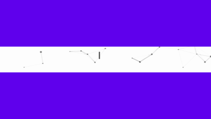

# Profile
<!--

-->

## A little about me...   
I'm an **Undergrate Student🎓 [@ Stony Brook University (SBU)]([(https://stonybrook.edu/)])** majoring in Applied Mathematics and Statistics, minoring in Finance. I'm a **Tech Enthusiast 💻 😃** passionate about learning and working with new tech. I love building interesting and amazing products that serve a great deal of purpose.   
- Ask me about **Machine learning, Deep Learning, Computer Vision, and Natural Language Programming**
- Skating and skiing
- Mountain Climbing and hiking
- Watch anime 

### How to reach me:
&nbsp;

## Skill Sets
### Languages

### Tools

### Libraries & Frameworks

### Cloud & DevOps & Systems

## 🏅 Certificates
- [Practical Reinforcement Learning (with honors)](https://www.coursera.org/account/accomplishments/certificate/AUVVSHZFH7XZ) @ Coursera
- [Introduction to Deep Learning (with honors)](https://www.coursera.org/account/accomplishments/certificate/D4VMH74AJHHK) @ Coursera
- [Bayesian Methods for Machine Learning (with honors)](https://www.coursera.org/account/accomplishments/certificate/5R62SGB3G6GF) @ Coursera
- [Hadoop. System for processing large amounts of data](https://stepik.org/cert/166893) @ Stepik
- [Certified Blockchain Architecture](https://www.credential.net/9d1345a7-9116-4883-a664-1fad1e8fbc48#gs.3oeb87)
- [IBM Artificial Intelligence](https://www.credly.com/badges/f5b994dc-9823-4f64-b136-c17192c72bf3)
- [IBM Blockchain Essentials V2 Certified](https://www.credly.com/badges/fa7c9ce3-dc3a-441c-96b2-277387a5f9d5)
- [IBM Blockchain Foundation Developer V2 Certified](https://www.credly.com/badges/3f046a2f-0701-4dd3-9ed6-eef01bfcc540)
- [IBM Big Data Foundations - Level 2](https://www.credly.com/badges/2f4f2e6b-dbf5-42e9-b6d7-1e446d0cd703)
- [IBM Cybersecurity Fundamentals](https://www.credly.com/badges/7cb43b8b-2640-451f-b5ac-5b16650622e7)'
 
## 🗂️ Highlight Projects

## 📊 Quick Stats

  

<i>“Be curious. Read widely. Try new things. What people call intelligence just boils down to curiosity.”</i>

<i>- Aaron Swartz (2013 ~ 1986) -</i>

<!--
## 📝 Blogs
- Personal website and blog: https://zhenye-na.github.io/
-->

<!--💬🃏QUOTESCARD / 🌐WEBSITE: https://github.com/PiyushSuthar/github-readme-quotes#Demo & https://github.com/cheehwatang/github-readme-daily-quotes & https://github.com/shravan20/github-readme-quotes -->
<!-- 

  
-->

## 👾 Cool Stuff
-  <a href="https://playground.tensorflow.org/#activation=tanh&batchSize=10&dataset=circle&regDataset=reg-plane&learningRate=0.03&regularizationRate=0&noise=0&networkShape=4,2&seed=0.03923&showTestData=false&discretize=false&percTrainData=50&x=true&y=true&xTimesY=false&xSquared=true&ySquared=false&cosX=false&sinX=false&cosY=false&sinY=false&collectStats=false&problem=classification&initZero=false&hideText=false">Peel Open</a> a Neural Network 🧠
-  A Way to <a href="https://stephango.com/40-questions">Reflect On</a> the New Year 🎊

<!--📰RSS / TAKE IMAGE FROM https://github.com/trinib/trinib/blob/main/images/marquee.svg TO YOUR REPO AND EDIT IT-->

<!-  README helping website 
https://github.com/abhisheknaiidu/awesome-github-profile-readme/tree/master?tab=readme-ov-file
https://github.com/DenverCoder1/readme-typing-svg
https://readme-typing-svg.demolab.com/demo/
https://github.com/thmsgbrt/thmsgbrt
https://codesandbox.io/examples/package/typeit
https://codesandbox.io/p/sandbox/cocky-cohen-9c5rjz?file=%2Fsrc%2Fcomponents%2FHelloWorld.vue
https://pjc0247.github.io/gif-for-readme/
-->
